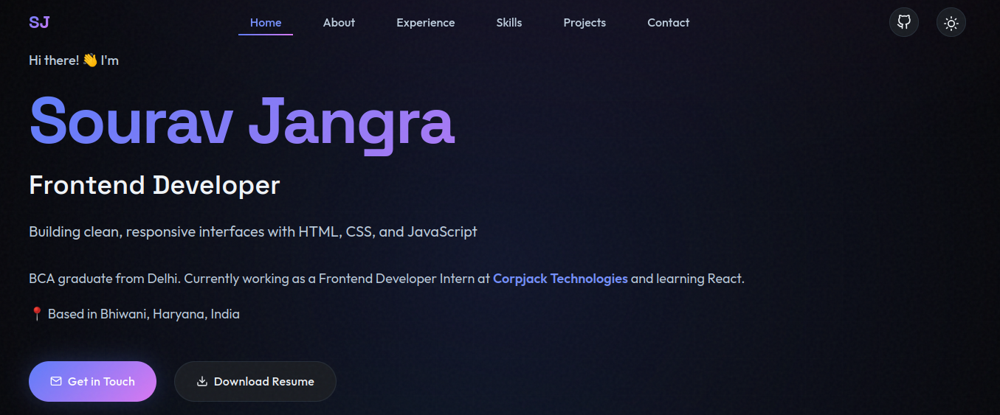

# Sourav Jangra - Portfolio

A modern, responsive portfolio website showcasing my frontend development skills, projects, and professional experience.

## 🚀 Live Demo

[View Portfolio](https://sourav-jangra-portfolio.vercel.app/)

## ✨ Features

- **Responsive Design**: Optimized for desktop, tablet, and mobile devices
- **Dark/Light Mode**: Theme toggle with persistent preferences
- **Smooth Animations**: Professional interactions powered by Framer Motion
- **Project Showcase**: Interactive filterable gallery of my work
- **Contact Form**: Easy way to get in touch

## 🛠️ Technologies Used

- React
- Vite
- Framer Motion
- EmailJS
- CSS3 with custom animations

## 📸 Preview

## 🎯 Sections

- **About**: Introduction to my background and expertise
- **Experience**: Professional work history and education
- **Skills**: Technical skills across frontend development
- **Projects**: Featured projects with live demos and source code
- **Contact**: Get in touch via form or social media

## 📫 Contact

- **Email**: jangrasourav277@gmail.com
- **LinkedIn**: [linkedin.com/in/sourav-jangra](https://linkedin.com/in/sourav-jangra)
- **GitHub**: [@Sourav-Jangra](https://github.com/Sourav-Jangra)

## 📄 License

MIT License
